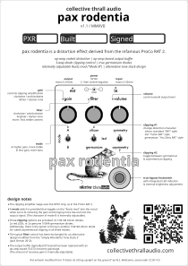

# pax rodentia

`pax rodentia` is a distortion effect pedal derived from the ProCo RAT 2 distortion.

It was not intended to be a novel design (although it makes some small changes to my own liking), but was used as a prototyping platform for the general design and manufacture of my pedals before moving to more novel designs.

## Included leaflet

## Design notes

The overall clipping amplifier design is close to an unmodified RAT topology.
 - The clipping amplifier stage uses the OP07 chip, as used in the RAT 2.
 - A `mode` switch is provided that toggles on the "Ruetz mod" into the circuit when set to B, reducing the gain and bringing more low end into the output signal. (The Ruetz substitution resistor is internally adjustable).
 - Three clipping options are provided, as well as the option to bring in another silicone diode for subtle asymmetrical clipping in all three modes.
 - The typical RAT tonestack has been exchanged for an alternative design modified from the "Simply Wonderful Tone Stack 3" design (Jack Orman).
 - The JFET output buffer has been replaced with an op-amp-based (TL072) recovery gainstage. (The amount of recovery gain is internally adjustable).

# Input & Output

 - 9V DC power via 2.1mm centre-negative DC jack
 - Input & output via 6.35mm mono (TS) instrument jacks

# Controls

 - `gain`: clipping amplification; clockwise for more distortion
 - `filter`: reduce high frequencies, anticlockwise for less highs/darker tone
 - `volume`: overall output level
 - `mode` (left): Switch between A (typical RAT tone) and B (less gain, more low end).
 - `clipping #1` (centre): Select clipping diodes. `silicon` = standard RAT tone; `led` = "turbo RAT" tone, `germanium` = "You Dirty RAT" tone.
 - `clipping #2` (right): Add/remove an additional silicone diode for asymmetrical clipping in all modes

# Internal controls

 - `Boost`: Increase or decrease the gain on the output gain stage. Increase if the pedal is too quiet, decrease if the pedal is too loud or is clipping at the second gain stage.
 - `Ruetz`: Change the overall frequency response of mode B.
 - `Brightness`: Adjust the footswitch LED brightness.

# More

For any information or issues, please contact me at `april@collectivethrallaudio.com` or `collectivethrallaudio` on instagram.

The schematic can be found at alongside this document at [`pxr-v1.1-schematic.pdf`](pxr-v1.1-schematic.pdf).

# Acknowledgements

Rat artwork modified from ["A black rat sitting upright on the ground" by W.S. Wellcome](https://commons.wikimedia.org/wiki/File:A_black_rat_sitting_upright_on_the_ground._Etching_by_W._S._Wellcome_V0020711.jpg), used under [CC BY 4.0](https://creativecommons.org/licenses/by/4.0/deed.en).

Significant resources used in the development of this pedal include:
 - ElectroSmash's [ProCo RAT Analysis](https://web.archive.org/web/20260428185017/https://www.electrosmash.com/proco-rat)
 - Beavis Audio Research's [ProCo RAT II Distortion Schematic](https://beavisaudio.com/schematics/ProCo-Rat-II-Distortion-Schematic.htm).
 - Jack Orman's amzfx, particularly the [Simply Wonderful Tone Control 3](https://www.muzique.com/lab/swtc3.htm)